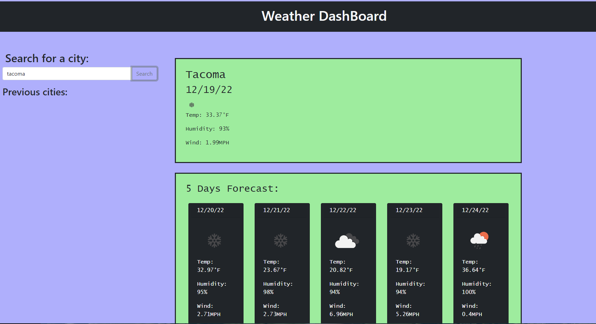

# weather-dashboard-app

## Description
This is a weather-dashboard website. It allows users to view the current and next 5 days forecast from the city users enter. 

## Usage 

Once you enter a valid city, current date will display at the top right side and the next 5 days forecast will display under the current date. 

The dates, weather icons, temperature, humidity and windy speed will also display in both current forecast and the next 5 days. 

## Technologies Use 
- Open Weather
- jQuery 
- Bootstrap

##Deployment Link

https://tweetwee1810.github.io/weather-dashboard-app/
